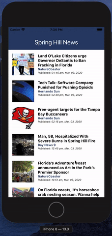

# Demo Vue Native App
An simple example of using [Vue Native](https://vue-native.io/) to quickly build a cross platform mobile app. Uses native elements + webview to connect to an api and render a simple news reader.

This app is the News section of [Spring Hill News](https://springhillnews.net/)

## Build Setup
Requires NodeJS + NPM (and Xcode if targeting iOS)
* Git clone this repo
* Install all dependencies: `npm install`
* Install Expo: `npm install --global expo-cli`
* To run inside of iOS Simulator: `npm run ios`

## To Build for Production
* iOS: `expo build:ios`
* Android: `expo build:android -t apk`
